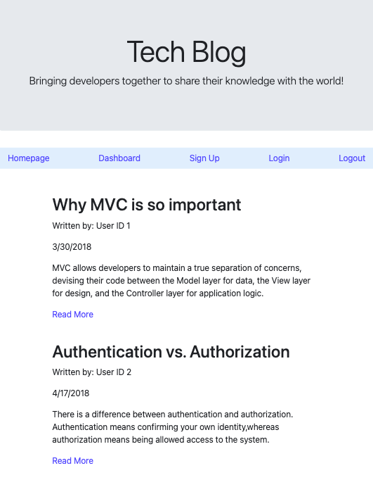
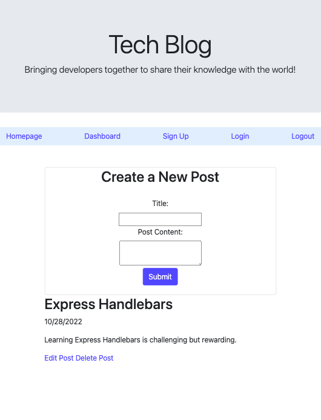

# Developer Blog Site

## Description

The Developer Blog Site is a CMS-style blog site where developers publish relevant blog posts. It uses the MVC paradigm for structure and Handlebars.js for templating. Express.js API routes have been configured with Sequelize to interact with a MySQL database. The express-session package is used for user authentification.

## Table of Contents

- [Installation](#installation)
- [Usage](#usage)
- [License](#license)
- [Contributing](#contributing)
- [Tests](#tests)
- [Questions](#questions)

## Installation 

Not required: application is deployed on Railway.

If you would like to run this application on your local machine, please use `npm i` to install all of the required packages found in the package.json file. 

* To create the tables for the database, add the db/schema.sql file data to your MySQL Workbench.

* Use `npm run seed` to seed the blog database.

* See the .envEXAMPLE file for the information needed to secure your connection to the database.

* Use `npm run watch` to start the server.

## Usage 

The Developer Blog Site allows the user to view blog posts written by other developers. 

* The homepage displays all of the posts that have been submitted.

A navigational bar has links for the homepage, dashboard, sign up, login, and logout.

When a user selects the dashboard link, they are directed to the login page because dashboard content is restricted.

* Users that haven't created a login must first sign up with their name, email, and a password. This establishes their login credentials and directs them to their personal dashboard.

Inside the dashboard, users can create and submit a new blog post. 

* Users that have previously created posts will see them displayed, along with options to edit or delete.

Users also have the option to interact with the posts of other users by leaving comments. The ability to leave comments also requires the user to be logged in.

[Developer Blog Site - Deployed Application](https://enigmatic-savannah-78345.herokuapp.com/)

## License 

The Developer Blog Site is available under the MIT license.

Please see [LICENSE](./LICENSE) for the full details of the license.

## Contributing 

The contributors of this application have adopted the Contributor Covenant Code of Conduct. Please visit the [Code of Conduct](./CODE_OF_CONDUCT) page for details.

## Tests 

This application doesn't have any tests at this time.

## Questions 

Please reach out via the the link below with any additional questions. 

[GitHub](https://github.com/smdann)
